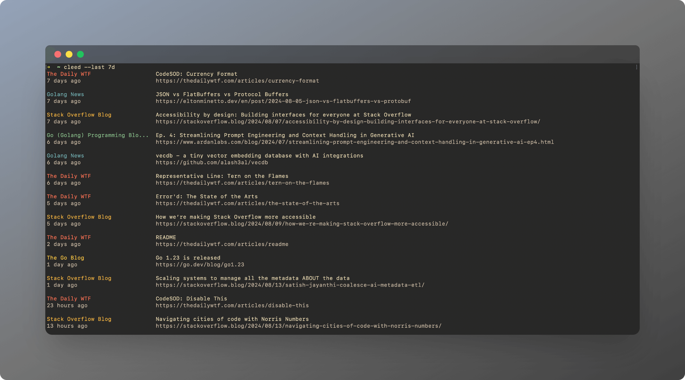

# cleed

Simple feed reader for the command line.




## Installation

#### MacOS - Homebrew

```bash
brew tap radulucut/cleed
brew install cleed
```

#### Windows - Scoop

```bash
scoop bucket add cleed https://github.com/radulucut/scoop-cleed
scoop install cleed
```

#### From source

```bash
go run main.go
```

#### Binary

Download the latest binary from the [releases](https://github.com/radulucut/cleed/releases) page.

## Usage

#### Follow a feed

```bash
# Add a feed to the default list
cleed follow https://example.com/feed.xml

# Add multiple feeds to a list
cleed follow https://example.com/feed.xml https://example2.com/feed --list mylist
```

#### Display feeds

```bash
# Display feeds from all lists
cleed

# Display feeds from a specific list
cleed --list my-list

# Display feeds since a specific date
cleed --since "2024-01-01 12:03:04"

# Display feeds since a specific period
cleed --since "1d"

# Display feeds since the last run
cleed --since last

# Display feeds from a specific list and limit the number of feeds
cleed --list my-list --limit 10
```

#### Unfollow a feed

```bash
# Remove a feed from the default list
cleed unfollow https://example.com/feed.xml

# Remove multiple feeds from a list
cleed unfollow https://example.com/feed.xml https://example2.com/feed --list mylist
```

#### List feeds

```bash
# Show all lists
cleed list

# Show all feeds in a list
cleed list mylist
```

#### Configuration

```bash
# Display configuration
cleed config

# Disable styling
cleed config --styling=2

# Map color 0 to 230 and color 1 to 213
cleed config --map-colors=0:230,1:213

# Remove color mapping for color 0
cleed config --map-colors=0:

# Clear all color mappings
cleed config --map-colors=

# Display color range. Useful for finding colors to map
cleed config --color-range

# Enable run summary
cleed config --summary=1
```

> **Color mapping**
>
> You can map the colors used in the feed reader to any color you want. This is useful if certain colors are not visible in your terminal based on the color scheme that you are using.
>
> Run `cleed config --color-range` to see the color range and map the colors that you want using the `cleed config --map-colors` command.
